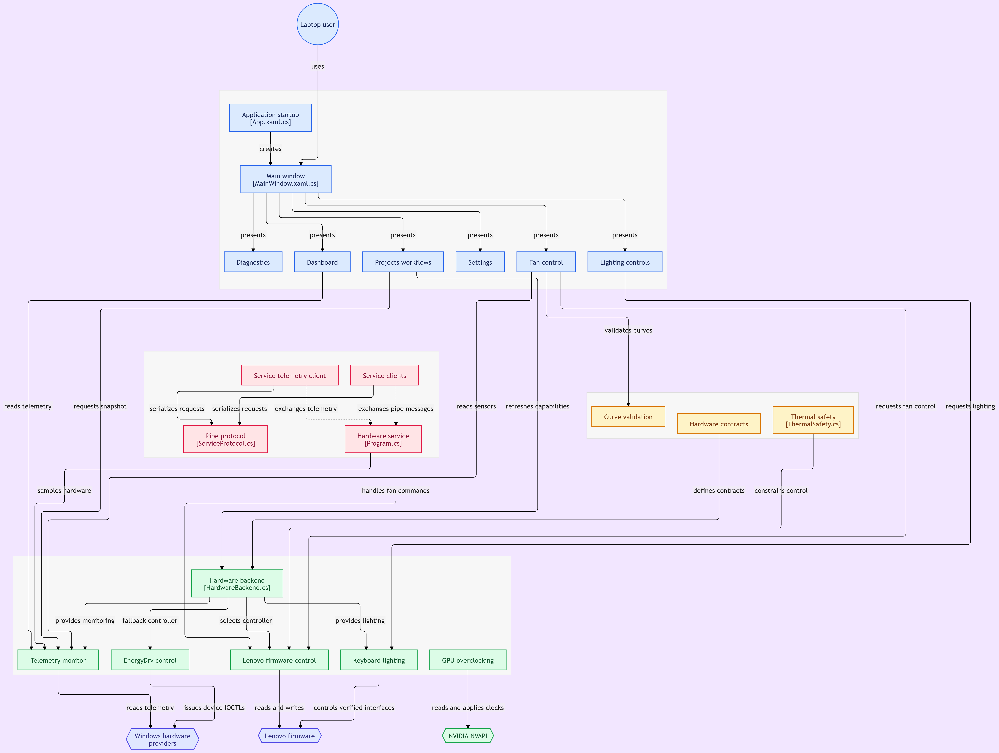
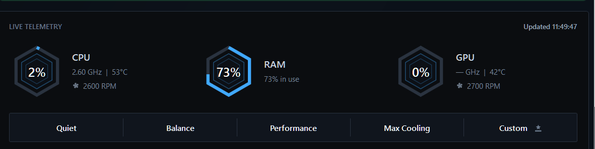

# LOQ Control

A native Windows desktop control center foundation for Lenovo LOQ laptops. Each capability is reported independently: Windows telemetry can work even when thermal sensors are missing, and a Lenovo performance-mode request can be available even when fan RPM or manual curves are not. The app does not write EC registers, ACPI addresses, kernel memory, BIOS settings, or undocumented vendor commands.

## Screenshots

The current WPF interface uses a dark, compact layout for live telemetry, fan
control, diagnostics, settings, and Lenovo integration management.

| Performance Modes | Fan control |
| --- | --- |
|  |  |

| Dashboard | Integration info |
| --- | --- |
|  |  |

| Keyboard Lighting | Profile and performance controls |
| --- | --- |
|  |  |

| Additional application view | Diagnostics Reports |
| --- | --- |
|  |  |

## System Architecture

 

## Build

Requirements: Windows 10/11 x64 and the .NET 8 SDK.

```powershell
dotnet build LenovoLoqControl.sln -c Debug -p:Platform=x64
dotnet test LenovoLoqControl.sln -c Debug
```

The UI is WPF on .NET 8 so it can build with the standard Windows Desktop SDK without requiring a separate WinUI workload. The presentation is isolated from `Core` and `Hardware`, allowing a future WinUI shell or model-specific backend without moving safety logic into the UI.

To run the desktop app after building:

```powershell
dotnet run --project src\LenovoLoqControl\LenovoLoqControl.csproj -c Debug -p:Platform=x64
```

The desktop app stays alive in the Windows notification area when its window is closed, so the selected firmware effect and telemetry loop continue without installing the Windows Service. Use the tray menu's **Open LOQ Control** command to restore the window or **Exit** to stop the process and release hardware resources.

The shared hardware monitor begins its first WMI/NVAPI sample while the application shell is being created and briefly caches the result. Dashboard, shell status, and Fan Control therefore reuse the same initial snapshot instead of waiting for separate startup queries.

## Keyboard lighting backend

The hardware backend detects keyboard capability instead of assuming a LOQ keyboard type. It probes Lenovo HID first for RGB-capable keyboards, then Lenovo's verified `LENOVO_LIGHTING_DATA` / `LENOVO_LIGHTING_METHOD` interfaces and the Toolkit-compatible `EnergyDrv` keyboard IOCTL fallback for white backlight. The verified Lenovo/ITE legacy RGB path uses vendor ID `048D`, a `C9xx` product family, and a 33-byte feature report with the `CC 16` protocol header used by Lenovo Toolkit. The LOQ 2024 `PID C993` identity remains a supported fallback for classification when its descriptor is nonstandard. `IKeyboardLightController` reports `WhiteBacklit`, `FourZoneRgb`, `TwentyFourZoneRgb`, `RgbLayoutUnknown`, or `Unsupported`; `Off`, `Low`, and `High` writes are enabled only for a verified white keyboard path. Exact RGB zone counts are never guessed from the laptop model: they require a matching HID identity or report descriptor, otherwise the software explicitly reports that the RGB layout is unknown.

The Lighting page includes a **Keyboard Lighting** card that follows those capabilities: white-backlit keyboards get Off/Low/High controls wired only through `GetCurrentLevelAsync` / `SetLevelAsync`; verified 4-zone RGB keyboards expose bounded effect, color, and speed controls through the gated Lenovo/ITE HID path. The UI exposes the effects confirmed to work on the current LOQ: Off, Static, Breathing, Smooth, and Wave. Smooth is rendered by the application preview; its HID command is intentionally not guessed. The additional LP5 modes are not selectable until their protocol is independently verified. 24-zone RGB and unknown layouts remain informational until their protocols are independently verified. Unsupported hardware shows an unavailable card with the backend availability message.

## Projects and repository workflows

The desktop **Projects** tab provides explicit maintenance workflows for capability refresh, a shared telemetry snapshot, verified Balanced-mode recovery, and optional hardware-service status. Each action reports success, unsupported hardware, or the provider error; no workflow silently claims an operation succeeded.

Repository automation is under `.github\workflows`: `build-test.yml` validates the x64 solution on pushes and pull requests, and `publish-artifacts.yml` publishes the desktop app and optional hardware service for releases or manual runs. Bug and feature issue forms are included under `.github\ISSUE_TEMPLATE`.

For a distributable x64 executable, publish self-contained and single-file:

```powershell
dotnet publish src\LenovoLoqControl\LenovoLoqControl.csproj `
  -c Release -r win-x64 --self-contained true `
  -p:PublishSingleFile=true -p:IncludeNativeLibrariesForSelfExtract=true `
  -o publish
```

The resulting `publish\LoqControl.exe` can be copied to another Windows 10/11
x64 machine. The app still runs as the signed-in user; publishing does not add
administrator privileges.

## MSI installation and updates

The versioned x64 MSI installs a direct (non-advertised) Start Menu shortcut,
so launching LOQ Control does not invoke Windows Installer self-repair. A
fresh installation launches the application asynchronously after finalization
so Windows Installer can finish instead of waiting for the long-running app
process. It also registers the same executable in the current user's Windows
startup list. MSI upgrades reuse the shared upgrade code to replace the
previous installation, while uninstall removes the startup registration and
Start Menu shortcut.

LOQ Control is single-instance. Launching it again activates the existing
window, including when the current window is minimized to the notification
area. During an update, the downloaded installer asks for confirmation,
closes the active session cleanly, replaces the installation, and starts one
new session.

The MSI only performs its automatic launch on a fresh install. During a
major upgrade, the updater handoff performs the single relaunch after
`msiexec` completes, preventing duplicate application windows.

## What works today

* **Windows telemetry:** refreshes CPU usage, CPU clock, memory usage, battery charge, and charging state every three seconds on the dashboard, with live fan and temperature telemetry refreshed separately on the Fan Control page. Polls are single-flight, and missing fields are shown as **Unavailable**; the app never estimates them.
* **Lenovo performance modes:** when `LENOVO_GAMEZONE_DATA` reports Smart Fan support, **Silent**, **Automatic**, and **Performance** use Lenovo firmware mode methods directly through `System.Management`. **Max Cooling** is an app-only action: it selects the verified Custom backing mode `255` and enables the verified `0x04020000` full-speed override. It is not inserted into the Lenovo Fn+Q cycle. Performance and Max Cooling are restricted to AC power. EnergyDrv remains a fallback for preset modes when the WMI provider is unavailable.
  On the verified LOQ firmware, successful ordinal mode requests let the firmware drive
  the chassis power indicator: Silent = blue, Automatic = white,
  Performance = red, and Custom = purple. The application does not write the
  LED independently or claim a color when the firmware command is rejected.
* **Thermal and fan sensors:** CPU/GPU temperatures, GPU usage, and fan RPM are separate capabilities. They remain **Unavailable** unless a supported provider is added, even if a performance-mode request is available.
* **Manual fan control:** custom fan tables are available only when the active Lenovo table passes capability and shape validation. The backend clears the separate full-speed flag, selects Custom mode, and sends the validated 64-byte table through direct WMI calls. Firmware acceptance is not treated as proof that the table persisted.
* **Custom Extreme Mode:** the Fan Control page exposes an Extreme Mode toggle inside Custom mode. It selects Custom firmware mode and enables the verified full-speed override without requiring a curve apply. Disabling it clears the override while leaving Custom mode selected. AC power is required.
* **NVIDIA GPU overclock:** when NVIDIA NVAPI detects a compatible discrete GPU, Custom mode exposes bounded offsets of up to +150 MHz core and +200 MHz VRAM. The default values match the requested 3.00→3.15 GHz and 8.00→8.20 GHz targets as offsets, but the actual live clock remains workload/boost controlled. The control requires AC power and provides an explicit reset.
* **Keyboard lighting:** white-backlit keyboards expose Off / Low / High on Fan Control through the verified Lenovo lighting WMI path. Verified 4-zone RGB keyboards expose effect controls backed by a capability-gated HID write path; 24-zone and unknown layouts are detected but remain read-only until verified. The application reports command failures explicitly and does not claim physical RGB success without a device response.
* **Diagnostics:** identity checks are shown for Lenovo and LOQ; unsupported sensor/control capabilities are reported as unavailable. The export button is not wired yet.



For example, a system with EnergyDrv should show “Preset modes available” and enable three mode buttons while still showing fan RPM as **Unavailable**. A system without the Lenovo driver should show “Monitoring only” for the performance-mode capability; Windows telemetry can still appear. Neither state requires administrator elevation.

The app does **not** select or edit a Windows power plan. Lenovo WMI and EnergyDrv
requests are firmware performance modes, separate from Windows' own
Balanced/Best performance power-plan setting.

## Verified host result

The development host was identified read-only as:

* Lenovo system product `83DV` / `LOQ 15IRX9`
* BIOS `NECN53WW`
* Battery `L23D4PK4` at 56% during the check
* Lenovo ACPI devices `LHK2019` and `VPC2004`
* Lenovo Vantage and ImController services running

The current check also exposes active `LENOVO_FAN_TABLE_DATA` records for
Custom mode (`Mode = 255`) and the `LENOVO_FAN_METHOD.Fan_Set_Table` method.
The app uses this capability only when the table contains the expected ten
temperature and ten fan-step entries. These facts are a diagnostic snapshot,
not hard-coded capability claims; another BIOS revision or installed driver may
produce a different result.

Telemetry provenance is intentionally narrow: identity comes from the Windows
BIOS registry keys `SystemManufacturer` and `SystemProductName`; CPU usage and
clock come from `Win32_Processor`; memory comes from
`Win32_OperatingSystem`; and battery percentage/charging state come from
`Win32_Battery`. A missing WMI row or provider error produces **Unavailable**
instead of a guessed value.

## Hardware policy

Windows has no universal, supported API for Lenovo LOQ fan RPM or manual fan curves. Lenovo models vary by firmware. This project therefore uses a capability-based hardware abstraction:

* `IHardwareMonitor` may return nullable values; unavailable sensors are displayed as unavailable.
* `IFanController` rejects unsupported performance-mode, direct-RPM, and curve commands with a visible explanation for the specific capability. On
compatible firmware, a custom curve is converted to Lenovo's ten firmware
steps, clamped to the toolkit-derived safe minimum `[1,1,1,1,1,1,1,1,3,5]`,
and sent as the documented-by-observation 64-byte `Fan_Set_Table` payload.
* `FanCurveValidator` rejects out-of-range, non-monotonic, and unsafe high-temperature curves before any backend could apply them.
* Any future Lenovo backend must be model-specific, bounded, timeout-aware, and independently verified before being registered in `HardwareBackend`.

The safe procedure for adding a backend is to document the interface source, supported model identifiers, read/write bounds, failure behavior, and hardware test results. Do not add arbitrary EC offsets or unsigned drivers.

Some Lenovo gaming firmware exposes reverse-engineered WMI providers such as
`LENOVO_FAN_METHOD` and `LENOVO_GAMEZONE_DATA`. These are not Lenovo-supported
third-party contracts, and their method names, IDs, table formats, and write
semantics vary by machine type and BIOS/EC revision. This project only enables the narrow mode and fan-table operations after the
provider reports Smart Fan support and the active Custom table passes shape
validation. It does not use the toolkit's full-speed cycling behavior.
Experimental LOQ projects that use direct MMIO/EC writes are not an acceptable
production dependency.

## EnergyDrv preset modes

When its read-only capability probe succeeds, the backend can use the installed
`\\.\EnergyDrv` device exposed by Lenovo ACPI-Compliant Virtual Power Controller.
This is conditional: the verified host above did not establish a supported
fan/RPM/manual-curve interface. If the probe fails, `HardwareBackend` selects
`UnsupportedFanController`, and all preset buttons remain disabled.

On a machine where the probe succeeds, EnergyDrv exposes only Lenovo firmware presets:

* **Silent** (`0x0013B001`)
* **Automatic** (`0x001F5001`)
* **Performance** (`0x0012B001`)

These are firmware mode requests, not direct RPM or fan-curve controls. The
unsafe high-speed dust-removal loop from the reference project is deliberately
not included. On application close, the backend attempts to restore Automatic
mode. Exact vendor verification is required before treating any preset as
available; undocumented WMI and direct EC/MMIO writes remain disabled.

## Real-hardware test procedure

Run these checks on the target Lenovo machine without changing firmware or
installing an unsigned driver:

1. Build or publish using the commands above, then launch `LoqControl.exe`.
2. Open **Dashboard** and confirm model, CPU/memory/battery values appear only
   when Windows WMI supplies them; unsupported temperature/GPU/fan fields must
   remain **Unavailable**.
3. Open **Diagnostics** and record Lenovo/model identity and each capability.
4. Open **Fan control**. If the EnergyDrv probe failed, verify the preset
   buttons are disabled and the explanation is visible. Do not bypass this
   state with undocumented WMI, EC offsets, MMIO, or kernel drivers.
5. Close the app and confirm it exits cleanly. If preset control was genuinely
   verified and used, confirm the backend's safe-state restore request is
   issued on close.

The application requests administrator access because Lenovo's EnergyDrv and
firmware WMI interfaces can deny hardware-control operations to unelevated
processes. If a Lenovo driver still denies access, the capability is reported
as unavailable.

Any remaining privileged child processes are launched only from verified Windows
system locations (`System32\WindowsPowerShell\v1.0\powershell.exe` and
`System32\sc.exe`) with the Windows system directory as their working
directory. Fan-mode and fan-table WMI operations do not spawn child processes.
The application does not use `PATH` lookup or `-ExecutionPolicy Bypass`. The
administrator requirement remains intentional until hardware writes are
isolated into a separate, narrowly scoped broker.

## Backend security boundaries

The UI and application layer do not construct WMI queries, invoke provider
methods, choose firmware IDs, or serialize fan-table payloads. Those operations
are isolated behind `ILenovoWmiOperations`, whose implementation contains the
allowlisted Lenovo WMI classes and methods. It accepts only the verified Smart
Fan mode values (`1`, `2`, `224`, `255`), the full-speed feature
(`0x04020000`) with binary values, and ten fan steps in the range `0..10`.
Unsupported or malformed requests fail before reaching WMI.

`HardwareBackend` owns the monitor and controller lifetimes and disposes them
when the window closes. WMI searches, result collections, device handles, and
command semaphores are disposed at their owning layer. This keeps privileged
hardware access auditable and prevents UI code from becoming a second hardware
control implementation.

The Settings page follows LenovoLegionToolkit's Vantage-disabler scope: it
detects `ImControllerService` and `LenovoVantageService`, disables Lenovo
scheduled-task folders, and terminates the related
`LenovoVantage`/`Lenovo.Modern.ImController` processes. It provides explicit
administrator actions to disable or restore the complete integration. This is
reversible but may disable Lenovo Vantage features, hotkeys, and other Lenovo
integrations while disabled. The app never changes the integration
automatically.
## Persistent hardware service

Telemetry refreshes at approximately 750 ms with overlapping reads suppressed. The desktop window no longer resets an accepted firmware mode when it closes, so the firmware-owned effect remains active.

For persistence across firmware/provider resets, publish the x64 `LenovoLoqControlService` project and run `scripts\Install-LoqControlService.ps1` from an elevated PowerShell prompt. The service is named `LoqControlHardwareService`, starts automatically with Windows, and reasserts standard verified modes only when the reported mode changes. It does not write undocumented EC registers or keep the WPF UI process running. Run `scripts\Uninstall-LoqControlService.ps1` to remove it.
